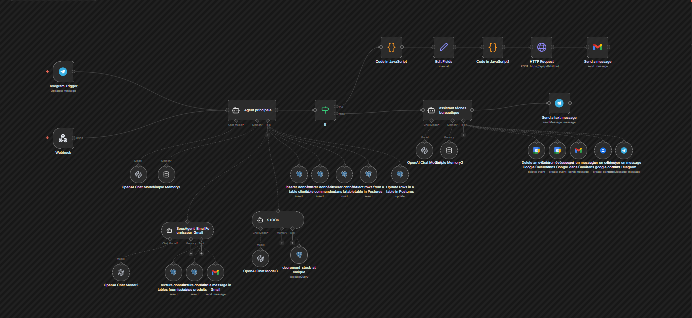

# Agent-IA-e-commerce-et-orchestrateur :Système d'automatisation e-commerce intelligent piloté par une IA multimodale. 

Projet complet d’automatisation e-commerce piloté par des *agents IA*, orchestré avec *n8n**, connecté à un *site React*, une base *PostgreSQL*, et un **bot Telegram** pour l’administration.

Ce projet démontre la mise en place d’un *système intelligent, modulaire et sécurisé*, capable de gérer des commandes, du stock, des fournisseurs, des emails, des rendez-vous et des tâches bureautiques via une interface conversationnelle.

---

I-Fonctionnalités principales

### 🛍️ E-commerce
- Gestion des **clients**
- Création de **commandes**
- Gestion des **lignes de commande**
- Calcul automatique des totaux
- Génération de **référence de commande unique**
- Décrémentation **atomique du stock**
- Prévention des stocks négatifs

### 📦 Gestion de stock & fournisseurs
- Seuil de stock par produit
- Alerte automatique fournisseur par email
- Commande fournisseur manuelle (admin)
- Sous-agent dédié à l’envoi d’emails fournisseurs

### 📄 Documents & notifications
- Génération automatique de **devis PDF**
- Envoi du devis par **email (Gmail)**
- Notifications automatiques
- Historisation des actions (audit) via un node memory

### II-🤖 Agents IA
- **Agent principal** : orchestration globale du système 
- **Sous-agent gestion de stock** : mise à jour sécurisée du stock après la commande d'un ou de plusieurs produits par un client.
- *Sous-agent email fournisseur (Safe 2)** : envoi d’emails aux fournisseurs pour la commande des produits à l'aide des informations contenus dans la base de données 
- Séparation claire décision / action
-*Sous-agents opérations bureautique Agenda & contacts:
...Création / modification / suppression d’événements **Google Calendar**
...Ajout / modification / suppression de contacts **Google Contacts**
...Email : Envoie de mail

###  Bot Telegram (Admin)
- Interface conversationnelle unique
- Questions / réponses (analytics, stock, top produits)
- Actions administratives sécurisées
- Confirmation obligatoire pour actions sensibles

##  Stack technique

- **Frontend** : React (Vite)
- **Automatisation** : n8n
- **IA** : OpenAI (agents + outils)
- **Base de données** : PostgreSQL
- **Emails** : Gmail API
- **PDF** : PDFShift
- **Bot** : Telegram Bot API
- **Tunneling**  : ngrok (pour l'accès externe des Webhooks)
- **Tools** : Google Calendar, Google contacts, Telegram send message node
- **Conteneurisation** : Docker & Docker Compose

---

##  Structure du projet

Agent-IA-e-commerce-et-orchestrateur/
│
├── Database/
│   ├── allFunction.sql
│   ├── allTrigger.sql
│   └── createTable..sql
|
|
├── docker/
│   ├── docker-compose.yml
│   ├── .env.example
|
│
├── n8n/
│   ├──agent_principal.json
|
|
│   ├── prompts/
│   │   ├── agentPrincipal.md
│   │   ├── sousAgentBureautique.md
│   │   ├── sousAgentEmailFournisseur.md
│   │   └── sousAgentStock.md
│   │
│   
│
├── Site e-commerce/
│   ├── src/
│   ├── public/
│   ├── package.json
│      └── README.md
|
|
├── Results/
│   ├── devis1.jpeg.
│   ├── devis2.jpeg
│   ├── mail1.jpeg.
│   ├── mail2.jpeg
│   ├── bot.jpeg
|
|
├── Scripts additionnels/
│   ├── devis.js
│   ├── extractionJson.js
|
|
├── Zdocs/
│   ├── architecture.png
│   ├── diagramme_sequence_commande_produits.png
│   
│
├── .gitignore
├── README.md

